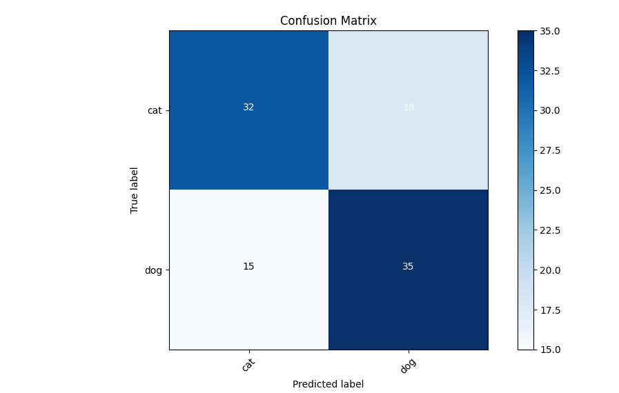
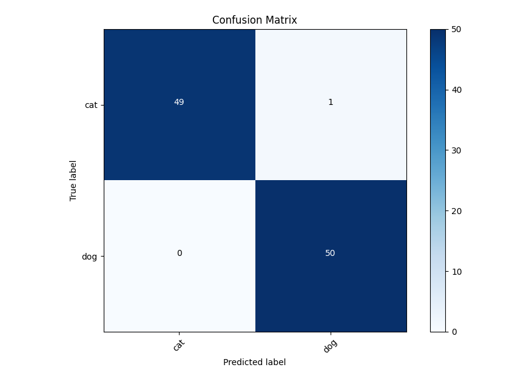

# Pet Image Classification Model

Этот проект посвящен обучению модели глубокого обучения для классификации изображений домашних животных (кошек и собак). Модель использует предобученную архитектуру **VGG16** для извлечения признаков и последующую доработку для задачи классификации. (`create_model_vgg16.py`, `recognise_pets_vgg16.py`)

## Dataset

Данные изображений домашних животных (кошек и собак) размещены в соответствующих директориях: `train`, `valid`, `test`.

## Шаги выполнения

1. **Подготовка данных**:
   - Изображения кошек и собак загружаются в директории `train`, `valid`, и `test`.
   - Используется **ImageDataGenerator** для генерации данных и их предварительной обработки, включая изменение размера изображений до 224x224 пикселей.

2. **Загрузка предобученной модели**:
   - Загружается предобученная модель **VGG16**, обученная на датасете **ImageNet**.
   - Модель без верхнего слоя (полносвязной слой) используется в качестве извлечения признаков.

3. **Адаптация модели**:
   - В модель добавляется новый классификатор для задач двухклассовой классификации (кошки и собаки), состоящий из слоя `Dense` с 2 выходами и функцией активации `softmax`.

4. **Обучение модели**:
   - Модель компилируется с использованием оптимизатора **Adam** и функции потерь **categorical_crossentropy**.
   - Модель обучается на тренировочных данных с использованием валидации для оценки точности.

5. **Сохранение модели**:
   - После завершения обучения модель сохраняется в файл `pets_model_vgg16.h5`, если она ещё не была сохранена.

6. **Использование модели**:
   - Загружается обученная модель и используется для предсказания классов (кошки или собаки) для изображений из тестового набора.
   - Выводится матрица ошибок (confusion matrix), показывающая производительность модели.

## Файлы для скачивания (фото живтоных)

```
https://www.kaggle.com/datasets/shaunthesheep/microsoft-catsvsdogs-dataset?resource=download
```

## Матрица Несоответствий

### Модель без VGG16



### Модель на основе VGG16



## Используемые библиотеки

- **TensorFlow/Keras** — для создания и обучения модели глубокого обучения.
- **NumPy, Matplotlib** — для работы с данными и визуализации.
- **Scikit-learn** — для вычисления метрики матрицы ошибок (confusion matrix).

## Структура проекта

```
recognise-pets
    ├───cm
    ├───models
    │   └───pets_model_vgg16.h5
    ├───pet-images
    │   ├───train
    │   │   ├───cat
    │   │   └───dog
    │   ├───valid
    │   │   ├───cat
    │   │   └───dog
    │   └───test
    │       ├───cat
    │       └───dog
    └───scripts
        └───recognise_pets.py
```        